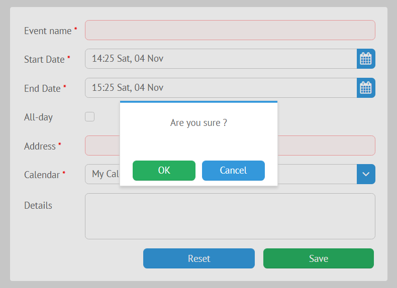
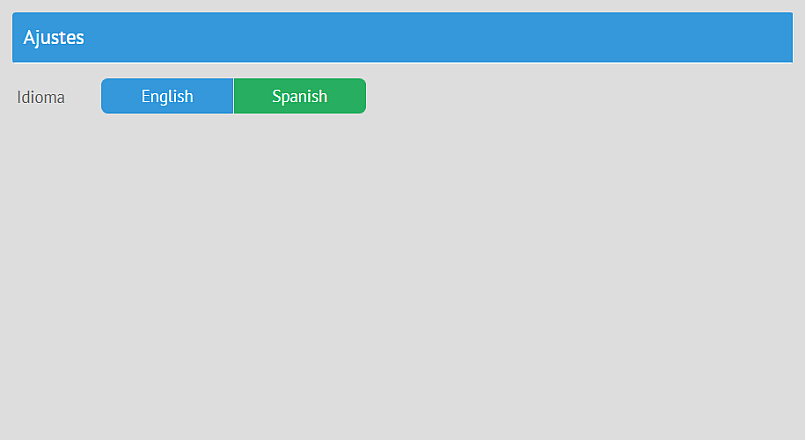

# Plugins

The new version of Webix Jet provides both predefined plugins and the ability to create your own. This is the general syntax to use a plugin:

~~~js
this.use(JetApp.plugins.PluginName, {
    id:"controlId", /* config
});
~~~

After the plugin name, you are to specify the configuration for the plugin, e.g. a control ID.

## 1. Default Plugins

- [the Menu plugin](#menu)
- [the UnloadGuard plugin](#unload)
- [the User plugin](#user)
- [the Theme plugin](#theme)
- [the Locale plugin](#locale)
- [the Status plugin](#status)

### <span id="menu">Menu Plugin</span>

This plugin simplifies your life if you plan to create a menu. The plugin sets URLs for menu options, buttons or other controls you plan to use for navigation. Also, there is no need to provide handlers to restore the state of the menu on page reload or URL change. The right menu item is highlighted automatically.


Let's create a toolbar with a segmented button and use the plugin for it:

~~~js
// views/toolbar.js
import {JetView} from "webix-jet";

export default class ToolbarView extends JetView{
	config(){
		return { 
			view:"toolbar", elements:[
				{ view:"label", label:"Demo" },
				{ view:"segmented", localId:"control", options:[
					"details",
					"dash"
				]}
		]};
	}
	init(ui, url){
		this.use(JetApp.plugins.Menu, {
			id:"control"
		});
	}
}
~~~

The plugin config contains the ID of the view element that is going to serve as a menu. If you click the buttons and reload the page, the app will behave as expected. The **Menu** plugin has one more good part. You can change the URLs for every menu item. Let's set URLs for the buttons in the plugin config:

~~~js
// views/toolbar.js
import {JetView} from "webix-jet";

export default class ToolbarView extends JetView {
	config(){
		return { 
			view:"toolbar", elements:[
				{ view:"label", label:"Demo" },
				{ view:"segmented", localId:"control", options:[
					"details",
					"dash"
				]}
		]};
	}
	init(ui, url){
		this.use(JetApp.plugins.Menu, {
			id:"control",
			urls:{
				details  : "demo/details",
				dash : "demo/dash"
			}
		});
	}
}
~~~

[Check out the demo >>](https://github.com/webix-hub/jet-start/blob/master/sources/views/top.js)

### <span id="unload">UnloadGuard Plugin</span>

The **UnloadGuard** plugin can be used to prevent users from leaving the view on some conditions. For example, this can be useful in the case of forms with unsaved or invalid data. The plugin can intercept the event of leaving the current view and, e.g. show the *are you sure* dialogue.



The plugin reacts to an attempt of changing the URL. The syntax for using a plugin is *this.use\(plugin,handler\)*. Use takes two parameters:

- a plugin name
- a function that will handle the **Unload** event

You can move validation from the **Save** button handler to the plugin handler. Let's have a look at a form with one input field:

```js
import {JetView} from "webix-jet";
export default class FormView extends JetView {
    config(){
        return { 
            view:"form", elements:[
                { view:"text", name:"email", required:true, label:"Email" },
                { view:"button", value:"save", click:() => this.show("Details") }
            ]
        };
    }
    init(ui, url){
        this.use(JetApp.plugins.UnloadGuard, () => {
            if (this.getRoot().validate())
                return true;

            return new Promise((res, rej) => {
                webix.confirm({
                    text: "Are you sure ?",
                    callback: a => a ? res() : rej()
                })
            });
        });
    }
}
```

If the input isn't valid, the function returns a promise with a dialogue window. Depending on the answer, the promise either resolves and the Guard lets the user go to the next view, or it rejects. No pasaran.

[Check out the demo >>](https://github.com/webix-hub/jet-demos/blob/master/sources/plugins-unload.js)

### <span id="user">User Plugin</span>

The *User* plugin is useful if you create apps that need authorization. When the plugin is included, the **user** service is launched. Let's look how to use the plugin with a custom script.

#### Login through a custom script

The plugin uses a **session** model, [check it out](https://github.com/webix-hub/jet-start/blob/php/sources/models/session.js). It contains requests to *php* scripts for logging in, getting the current status, and logging out. In the code, there are following functions:

- **status** - returns the status of the current user:

```js
// models/session.js
function status(){
	return webix.ajax().post("server/login.php?status")
		.then(a => a.json());
}
```

- **login** - logs the user in, returns an object with his/her access rights settings, a promise of this object or *null* if something went wrong. The parameters are:

- *user* - username;
- *pass* - password.

```js
// models/session.js
function login(user, pass){
	return webix.ajax().post("server/login.php", {
		user, pass
	}).then(a => a.json());
}
```

- **logout** - logs the user out:

```js
// models/session.js
function logout(){
	return webix.ajax().post("server/login.php?logout")
		.then(a => a.json());
}
```

To use a plugin, call *app.use* and pass the **session** model to it:

```js
// myapp.js
import session from "models/session";
...
app.use(plugins.User, { model: session });
```

Here's an example of a form for logging in, which can be included into a view class:

```js
// views/login.js
const login_form = {
	view:"form",
	rows:[
		{ view:"text", name:"login", label:"User Name", labelPosition:"top" },
		{ view:"text", type:"password", name:"pass", label:"Password", labelPosition:"top" },
		{ view:"button", value:"Login", click:function(){
			this.$scope.do_login();
		}, hotkey:"enter" }
	],
	rules:{
		login:webix.rules.isNotEmpty,
		pass:webix.rules.isNotEmpty
	}
};
```

The form has two validation rules.

To implement the way to log in, you can use the **login** method of the *User* plugin.

###### login(name, password)

**login** receives the username and the password, verifies them and if everything's fine, shows the *afterLogin* page. Otherwise, it shows an error message. 

Here's how the **do_login** method is implemented:

```js
// views/login.js
import {JetView} from "webix-jet";

export default class LoginView extends JetView{
	...
	do_login(){
		const user = this.app.getService("user");
		const form = this.getRoot().queryView({ view:"form" });

		if (form.validate()){
			const data = form.getValues();
			user.login(data.login, data.pass).catch(function(){
				//error handler
			});
		}
	}
	...
}
```

If users submit their name and password, *user.login* is called. You can add an error handler for an invalid username and password.

**Related demo**:

- The [complete *login.js* file](https://github.com/webix-hub/jet-start/blob/php/sources/views/login.js);
- The [demo on logging in with custom scripts](https://github.com/webix-hub/jet-start/tree/php).

The **User** plugin has other useful methods.

###### getUser()

**getUser** returns the data of the currently logged in user.

###### getStatus()

**getStatus** returns the current status of the user. It can receive an optional boolean parameter *server*. The **User** service checks every 5 minutes the current user status and warns a user if the status has been changed. For example, if a user logged in and didn't perform any actions on the page during some time, the service will check the status and warn the user if it has been changed.

###### logout()

**logout** ends the current session and shows an afterLogout page, usually it's the login form.


#### Login with an external OAuth service ( Google, Github, etc. )

<!-- to be continued -->

### <span id="theme">Theme plugin</span>

This is a plugin to change app themes. The plugin launches the **theme** service. There are two methods that the service provides:

###### getTheme()

The method returns the name of the current theme.

###### setTheme(name)

The method takes one obligatory parameter - the name of the theme - and sets the theme for the app.

Consider an example. The service locates links to stylesheets by the *title* attribute. Here are the stylesheets for the app:

```html
// index.html
<link rel="stylesheet" title="flat" type="text/css" href="//cdn.webix.com/edge/webix.css">
<link rel="stylesheet" title="compact" type="text/css" href="//cdn.webix.com/edge/skins/compact.css">
```

Next, you need to provide a way for users to choose themes. Here's a view with a segmented button:

```js
// views/settings.js
import {JetView} from "webix-jet";

export default class SettingsView extends JetView {
	config(){
		return {
			type:"space", rows:[
				{ template:"Settings", type:"header" },
				{ name:"skin", optionWidth: 120, view:"segmented", label:"Theme", options:[
					{id:"flat-default", value:"Default"},
					{id:"flat-shady", value:"Shady"},
					{id:"compact-default", value:"Compact"}
				], click:() => this.toggleTheme() /* not implemented yet */ }
				{}
			]
		};
	}
}
```

Note that option IDs should have two parts, the first of them must be the same as the *title* attribute of the link to a stylesheet. The **theme** service must get the theme name, chosen by a user. Then it locates the correct stylesheet and sets the theme. Let's add a handler for the segmented button and define it as a class method:

```js
// views/settings.js
import {JetView} from "webix-jet";

export default class SettingsView extends JetView {
	...
	toggleTheme(){
		const themes = this.app.getService("theme");
		const value = this.getRoot().queryView({ name:"skin" }).getValue();
		themes.setTheme(value);
	}
}
```

Inside the method, the **theme** service is launched. Then **queryView** located the segmented by its name and gets the user a choice. After that, the service sets the chosen theme by adding a corresponding CSS class name to the body of the HTML page.

To restore the state of the segmented button after the new theme is applied, you need to get the current theme in the class **config** and add the **value** property of the segmented setting it to the correct value:

```js
// views/settings.js
const theme = this.app.getService("theme").getTheme();
...
	{ name:"skin", optionWidth: 120, view:"segmented", label:"Theme", options:[
		{id:"flat-default", value:"Default"},
		{id:"flat-shady", value:"Shady"},
		{id:"compact-default", value:"Compact"}
	], click:() => this.toggleTheme(), value:theme }
...
```

[Check out the complete code >>](https://github.com/webix-hub/jet-demos/blob/master/sources/plugins-theme.js)

### <span id=""locale>Locale plugin</span>

This is a plugin for localizing apps. Locale files are usually created in the *locales* folder. This is an example of the Spanish locale file:

```js
// locales/es.js
export default {
	"Settings" : "Ajustes",
	"Language" : "Idioma",
	"Theme" : "Tema"
};
```

The Locale plugin launches a service. The **locale** service has several methods for localizing apps.

###### the _(value) helper

This helper looks for the field in a locale file and returns the translated value. E.g. *this.app.getService("locale")._("Settings")* will return *"Ajustes"*, if Spanish is chosen. If you need to localize a lot of text, it's reasonable to create a shorthand for the method:

```js
const _ = this.app.getService("locale")._;
```

###### getLang()

The method returns the current language.

###### setLang(name)

The method sets the language passed by the name of the locale file. It also calls **app.refresh** and re-renders all the views.

Consider an example:

```js
import {JetApp, JetView, plugins} from "webix-jet";

export default class SettingsView extends JetView {
	config(){
		const _ = this.app.getService("locale")._; 				//shorthand
		const lang = this.app.getService("locale").getLang();

		return {
			type:"space", rows:[
				{ template:_("Settings"), type:"header" },
				{ name:"lang", optionWidth: 120, view:"segmented", label:_("Language"), options:[
					{id:"en", value:"English"},
					{id:"es", value:"Spanish"}
				], click:() => this.toggleLanguage(), value:lang },
				{}
			]
		};
	}
	toggleLanguage(){
		const langs = this.app.getService("locale");
		const value = this.getRoot().queryView({ name:"lang" }).getValue();
		langs.setLang(value);
	}
}
```

When a user chooses a language, a corresponding file is located and the app language is changed. IDs of the language options should be the same as the locale file names (e.g. "es", "en"). **getLang** in config returns the current locale, which is used to restore the value of the segmented button.

[Check out the demo >>](https://github.com/webix-hub/jet-demos/blob/master/sources/plugins-locale.js)



### <span id="status">Status Plugin</span>

This plugin is useful if you want to show the status of data loading in case it takes time, to confirm success or to show an error message. These are the status messages that you can see:

- "Ok"
- "Error"
- "Connecting..."

This is how you can include the plugin:

```js
// views/data.js
...
config(){
	return {
		rows:[
			{ id:"app:status", view:"label" }
		]
	};
}
init(){
	this.use(plugins.Status, { 
		target: "app:status",
		ajax:true,
		expire: 5000
	});
}
```

The **target** property is the ID of the view component where you want to display the message (a label in this example). *ajax:true* enables asynchronous requests. *expire* defines the time after which the status message disappears (5 seconds in this case). By default, the time is set to 3 seconds, and if you set it to 0, the status message will stay as long as the page is open.

**Status** can have two more properties in its config:

- **data** - a property that defines the ID of the data component to track.
- **remote** - a boolean property that enables *webix.remote* - a protocol that allows the client component to call functions on the server directly.

[Check out the demo >>](https://github.com/webix-hub/jet-demos/blob/master/sources/plugins-status.js)


## 2.Custom Plugins

You can define your own plugins.