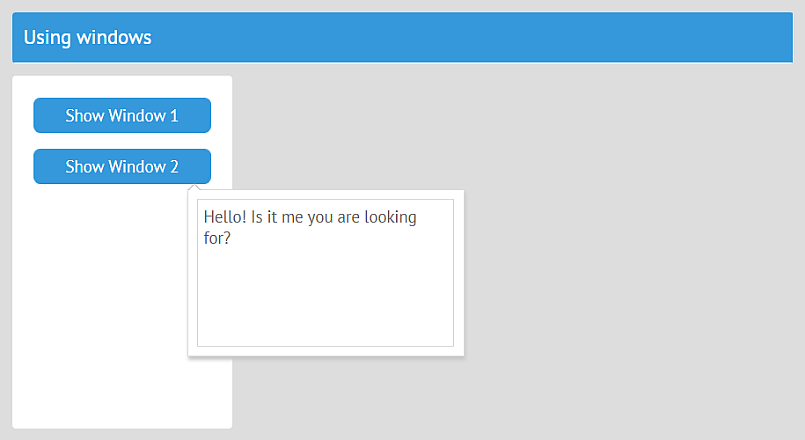

# Working with Popups and Windows

Temporary views like popups and windows can be created with **this.ui**. **this.ui** takes care of the windows it creates and destroys them when their parent views are destroyed.

Consider a simple popup view:

```js
const win1 = {
	view:"popup",
	body:{ template:"Text 1" }
};
export default win1;
```

Let's define a view class that will create this popup:

```js
export default class TopView extends JetView {
	config(){
		return {
			cols:[
                { view:"form",  width: 200, rows:[
                    { view:"button", value:"Show Window 1" }
                ]},
                { $subview: true }
            ]
        };
	}
}
```

The popus is created in **init** of *TopView*:

```js
init(){
    this.win1 = this.ui(win1);
}
```

**this** refers to *TopView*. **win1** becomes its child view. To show **win1**, call **this.win1.show()**. Here's the button click handler:

```js
{ view:"form",  width: 200, rows:[
    { view:"button", value:"Show Window 1", click:(id) =>
        this.win1.show($$(id).$view) }
]}
```

**this.win1.show** renders the popup at a position, defined by the parameter. In the code sample, the parameter is the HTML code of the button that calls the method, so the popup appears below the button. If you do not pass a parameter, **win1** will be rendered in the top left corner.

You can create windows and popups with view classes as well. Have a look at a similar popup:

```js
class WindowsView extends JetView {
	config(){
		return {
			view:"popup",
			body:{ template:"Text 2" }
		};
	}
	show(target){
		this.getRoot().show(target);
	}
}
```

Unlike with a simple view, with a class view you have to redefine **show**. *this.getRoot* refers to the popup UI. So *this.getRoot().show(target)* does the same thing as *this.win1* from the previous example with a simple view **win1**. It shows the popup below the target view or component.



Here's how you initiate and show this popup (spoiler: exactly the same way as **win1**):

```js
export default class TopView extends JetView {
	config(){
		return {
			cols:[
                { view:"form",  width: 200, rows:[
                    { view:"button", value:"Show Window 2", click:(id) =>
                        this.win2.show($$(id).$view) }
                ]},
                { $subview: true }
            ]
        };
	}

	init(){
		this.win2 = this.ui(WindowsView);
	}
}
```

[Check out the demo on GitHub >>](https://github.com/webix-hub/jet-demos/blob/master/sources/windows.js)