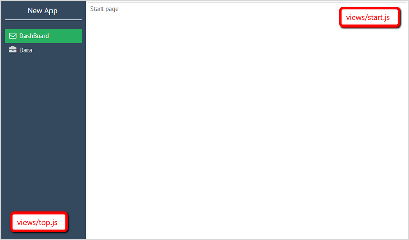
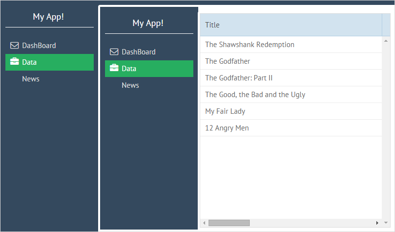

# Getting Started

## Advantages of Webix Jet

Webix Jet allows you to create flexible, easily maintainable apps, where data and visual presentations are clearly separated, interface elements can be easily combined and reused, all parts can be developed and tested separately - all with minimal code footprint. It has a ready to use solution for all kinds of tasks, from simple admin pages to fully-fledged apps with multiple locales, customizable skins, and user access levels.

Webix Jet is a fully client-side solution and can be used with any REST-based data API. So there are no special requirements to the server.

## How to Start

To begin with, you should grab the app package from [https://github.com/webix-hub/jet-start/archive/master.zip](https://github.com/webix-hub/jet-start/archive/master.zip) and unpack it locally. After that, run the following commands in the target folder \(this assumes that you have _Node.js_ and _npm_ installed\):

```text
npm install
npm start
```

Next, open `http://localhost:8080` in the browser. You will see the application interface. Let’s have a look at what it has inside.

## The Application Structure

The codebase of the app consists of:

* the _index.html_ file that is a start page and the only html file in the app;
* the _sources/myapp.js_ file that creates the app and contains app configuration;
* the _sources/views_ folder containing modules for interface elements;
* the _sources/models_ folder that includes modules for data operations;
* the _sources/styles_ folder for CSS assets;
* the _sources/locales_ folder for app locales \(you can ignore it for now\).

## How it Works

The basic principle of creating an app is the following. The app is a single page. It is divided into multiple views, which will be kept in separate files. Thus, the process of controlling the behavior of the app gets much easier and quicker.

Navigation between pages works, when the URL of the page changes. But as this is a single page app, only the part of the URL after the hashbang \(\#!\) will change, not the main URL. The framework will react to the URL change and rebuild the interface from these elements.

The app splits the URL into parts, finds the corresponding files in the _views_ folder and creates an interface by combining UI from those files.

For example, there are 2 files in the _views_ folder of our app:

* top.js
* start.js

If you set the path to _index.html\#!/top/start_, the interface described in the _views/top.js_ file will be rendered first. Then the interface from _views/start_ will be added in some cell of the top-level interface:

**index.html\#!/top/start**



## Defining a View Module

**views/start**

The _start.js_ file describes a start page view:

```javascript
//views/start.js
export default {
    template:"Start page"
};
```

This is a module that returns a template with the text of the page.

You can look at this page by opening the URL _index.html\#!/start_.

**views/top**

The _views/top_ module defines the top level view, that contains a menu and includes the start page view, which have been described above:

```javascript
//views/top.js
import start from "views/start"

export default {
    cols:[
        { view:"menu" },
        start
    ]
};
```

In the above code, there is a layout with two columns. At the top of the file, there is the list of dependencies, which will be used in this layout.

Open the path _index.html\#!/top_, and you will see the page with the _start_ view inside of _top_.

## Creating Subviews

As it has already been said, our app consists of a single page. How is the process of views manipulation organized?

Check out the following code:

```javascript
//views/top.js
export default {
    cols:[
        { view:"menu" },
        { $subview: true }
    ]
};
```

The line _{ $subview: true }_ implies that you can enclose other modules inside of the top module. The next segment of the URL will be loaded into this structure. So for rendering the interface including a particular subview, put its name after _index.html\#!/top/_ like _index.html\#!/top/start_. The _{ $subview: true }_ placeholder will be replaced with the content of a subview file \(_views/start.js_ in the above example\) and the corresponding interface will be rendered.

For example, there is a _data.js_ view, which contains a datatable. If you enter the URL _index.html\#!/top/data_, you will get the interface with a menu in the left part and a datatable in the right part:

**index.html\#!/top/data**


Then, add one more _/top_ subdirectory into the path. The URL will look as _index.html\#!/top/top/data_ and the app will have another menu view inserted into the first one. This view will contain the datatable:

**index.html\#!/top/top/data**



The described way of inserting subviews into the main view is an alternative to specifying the necessary subview directly in the main view code.

For more details on including subviews, go to the chapters ["Creating views"](part-i-basic-usage/creating-views.md) and ["Views and Subviews"](part-ii-webix-jet-in-details/views-and-subviews.md#subview-including).

## Loading Data with Models

While views contain the code of interfaces, models are used to control the data. Let's consider data loading on the example of the _views/data.js_ file. It takes data from the _models/records_ module. To load data into the view, let's use a data collection. Take a look at the content of the _records.js_ file:

```javascript
//models/records.js
export const data = new webix.DataCollection({
    url:"data.php"
});
```

In this module, there is a new data collection that loads data from the _data.php_ file. The module returns a helper method that provides access to DataCollection.

The _views/data_ module has the following code:

```javascript
//views/data.js
import {JetView} from "webix-jet";
import {data} from "models/records";

export default class DataView extends JetView{
    config(){
        return { view:"datatable", autoConfig:true }
    }
    init(view){
        view.parse(data);
    }
};
```

As you can see, this module returns an object that differs from those described earlier. There are two variants of the return object. It can be simply a description of interface or a JetView-based class, which can have:

* the _config_ method that returns the interface of the component that will be initialized. In this example, it’s a datatable;
* the _init_ method that specifies the component initialization behavior, in our case data from the _records_ model will be loaded into the view after its creation. 

## Further Reading

* ["Creating views"](part-i-basic-usage/creating-views.md)
* ["Views and Subviews"](part-ii-webix-jet-in-details/views-and-subviews.md#3-class-views)
* ["Models"](part-ii-webix-jet-in-details/models.md)

