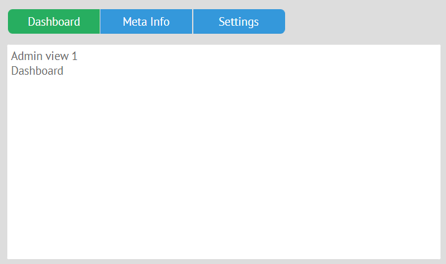
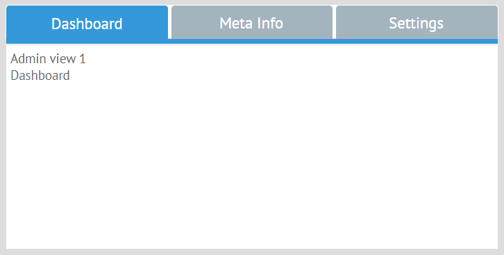

## Placing Jet views into Multiview / Tabview

You can place Jet views inside Multiview.



### 1\. Multiview control

Jet views can be included into Multiview. First, you need to create Multiview and put Jet views as _$subviews_ into each cell. Next, add a control to switch between Multiview cells - for example, a segmented button. *segmented* needs IDs of the subviews. It is very important not to define IDs outside the file with Multiview, because it is unsafe. A better approach is to give IDs to the contents of the Multiview cells.

```js
// views/top.js
import {JetView} from "webix-jet";
import {ChildView1} from "views/childview1";
import {ChildView2} from "views/childview2";

export default class TopView extends JetView {
	config(){
		return {
			rows: [
				{ view:"segmented", multiview:true, options:[
					"Dashboard", "Meta Info"
				]},
				{ view:"multiview", cells:[
					{ $subview:ChildView1, id:"Dashboard" },    //load views/childview1.js
					{ $subview:ChildView2, id:"Meta Info" }     //load views/childview2.js
				]}
			]
		};
	}
}
```

[Check out the demo on GitHub >>](https://github.com/webix-hub/jet-demos/blob/master/sources/tabbar.js)

### 2\. Tabview



You can also put subviews into a Tabview. In this case you do not need IDs, you need to import the subviews and place them into the *body* of Tabview cells:

```js
// views/top.js
import {JetView} from "webix-jet";
import ChildView1 from "views/childview1";
import ChildView2 from "views/childview2";

export default class TopView extends JetView {
	config(){
		return {
			rows: [
				{ view:"tabview", cells:[
					{ header:"Dashboard", body:ChildView1 },
					{ header:"Meta Info", body:ChildView2 }
				]}
			]
		};
	}
}
```

You can also add tabs with Jet views into TabView with **addView()**. A new instance of Jet view can be created with the class constructor.

```js
// views/top.js
import {JetView} from "webix-jet";
import ChildView1 from "views/childview1";
import ChildView2 from "views/childview2";
import NewTabView from "views/newtab";

export default class TopView extends JetView {
	config(){
		return {
			rows: [
                {
                    view:"button", value:"Add new", click:()=>{
                        this.addTab();
                    }
                },
				{ view:"tabview", localId:"tabs", cells:[
					{ header:"Dashboard", body:ChildView1 },
					{ header:"Meta Info", body:ChildView2 }
				]}
			]
		};
    }
    addTab(){
        this.$$("tabs").addView({
            header:"New Tab",
            body:new NewTabView(this.app)   //a class view
        })
    }
}
```

[Check out the solution on GitHub >>](https://github.com/webix-hub/jet-demos/blob/master/sources/tabbar.js)

## Jet Views in Webix Dashboard

You can put Jet views on panels of [Webix Dashboard](https://webix.com/widget/dashboard/).

### Static panels

Static panels can be created in _cells_:

```js
// views/dashboard.js
import {JetView} from "webix-jet";
import AdminView1 from "views/admin1.js";
export default class TopView extends JetView {
	config(){
		return {
			view:"dashboard",
            gridColumns:4, gridRows:4,
            cellHeight: 200,
            cells:[
                {
                    view:"panel",
                    x:0, y:0, dx:1, dy:1,
                    body:AdminView1
                }
            ]
		};
	}
}
```

### Dynamic panels

You can also create a [dynamic dashboard](https://blog.webix.com/webix-dashboard-layout-how-to-build-appealing-dynamic-dashboards/) with Jet views. For example, panels can be dragged from a list like this:

```js
// views/dashboard.js
import {JetView} from "webix-jet";
import AdminView1 from "views/admin1.js";
import AdminView2 from "views/admin2.js";
...
export default class TopView extends JetView {
	config(){
		return {
			cols: [
				{ view:"list", id:"list",
                    width:200,
                    drag:"source",
                    template:"#value# - (#dx#x#dy#)",
                    data:[
                        { id:"1", value:"AdminView1", dx:1, dy:1 },
                        { id:"2", value:"AdminView2", dx:1, dy:2 },
                        ...
                    ]
				},
				{
					view:"dashboard", id:"grid",
                    gridColumns:4, gridRows:4,
                    cellHeight: 200
				}
			]
		};
	}
}
```

Dynamic Dashboard panels can be created with a [_factory_](https://docs.webix.com/api__link__ui.dashboard_factory_config.html) instead of _cells_.

Save all the Jet views in class properties. After that define the factory that will place Jet views on panels:

```js
// views/dashboard.js
import {JetView} from "webix-jet";
import AdminView1 from "views/admin1.js";
import AdminView2 from "views/admin2.js";
...
export default class DashboardView extends JetView {
	config(){
		return {
            cols: [
				// ...list
				{
					view:"dashboard", id:"grid",
                    gridColumns:4, gridRows:4,
                    cellHeight: 200,
                    factory:(obj) => {
                        obj.view = "panel";
                        obj.resize = true;
                        obj.body = this[$$("list").getItem(obj.name).value];
                        return obj;
                    }
				}
			]
		};
    }
    init(){
        this.AdminView1 = AdminView1;
        this.AdminView2 = AdminView2;
        ...
    }
}
```

[Check out the demo >>](https://github.com/webix-hub/jet-demos/tree/master/sources/dashboard.js)

## Jet Views as Subviews and Subgrids of Webix Datatable

You can also nest Jet views of any complexity into Datatable by including them into _Datatable subviews_ [1].

Let's add subviews into this datatable:

```js
// views/top.js
import {JetView} from "webix-jet";
export default class TopView extends JetView {
	 config(){
		return {
			view:"datatable",
			columns:[
				{ id:"title",   header:"Title", sort:"string",
				template:"{common.subrow()} #title#", width:220 },
				{ id:"year",    header:"Year",  width:100, sort:"int"},
        		{ id:"votes",   header:"Votes", width:100,  sort:"int"}
			],
			data:[
				{ id:1, title:"The Shawshank Redemption", year:1994, votes:678790 },
				{ id:2, title:"The Godfather", year:1972, votes:511495 },
				{ id:3, title:"The Godfather: Part II", year:1974, votes:319352 }
			]
		};
	}
}
```

One Jet view class will be used for all subviews, but with different data. Let's use the ability to create Jet class instances with constructors.

> #### Caution::Note
>
> This will work only for synchronous Jet views.

Let's define the constructor that will call the parent constructor of the JetView class and then get the right data from a parent row of Datatable:

```js
// views/subgrid.js
import {JetView} from "webix-jet";
export default class SubLayout extends JetView {
	constructor(app, name, data){
		super(app, name);
		this.customData = data;
	}
	config(){
		return {
			rows:[
				{ type:"header", template: () => this.customData.title },
				{ template:"Subview", height: 30 }
			]
		}
	}
}
```

Let's include _SubLayout_ into the Datatable in _TopView_. **subview** of Datatable can be defined as a function with two parameters:
- **obj** - and object with the item data,
- **target** - the HTML node below the row where the subview will be opened.

The _subview_ function must return the UI of the subview.

You can create instances of _SubLayout_ with right data inside **config()** of _TopView_. Call the constructor and pass the data as the third parameter. Then, use **this.ui()** to place the _SubLayout_ below the row of Datatable and the return the UI of the newly created Jet view:

```js
// views/top.js
import {JetView} from "webix-jet";
export default class TopView extends JetView {
	config(){
		return {
			view:"datatable",
			subview: (obj, target) => {
				var sub = new SubLayout(this.app, "", {
					title: obj.title 
				});
				this.ui(sub, { container: target });
				return sub.getRoot();
			},
			//datatable config
		};
	}
}
```

## Using _addView()_ with Jet Views

You can use Webix **addView()** method to add Jet views into Webix layouts [2]. You can add new elements on the fly, which is especially important for Dashboard. Also, **addView()** can be used with Layout, Tabview, Multiview, Carousel, etc.

```js
this.$$("layout").addView(WebixJetView);
```

[Check out the demo >>](https://github.com/webix-hub/jet-demos/tree/master/sources/addview.js)

---
[1],[2]:
Starting with Webix 5.3
