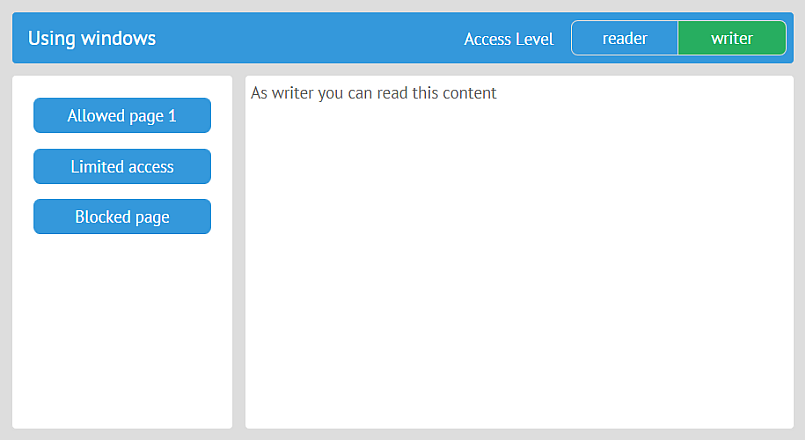
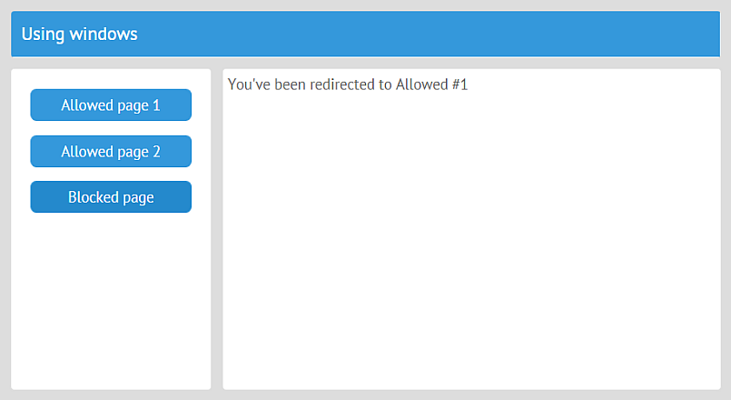
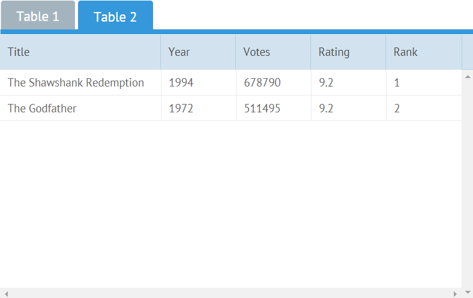
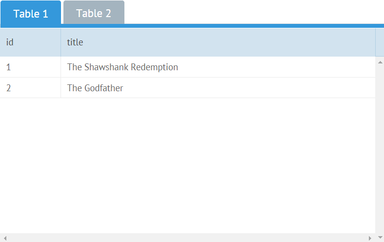

# <span id="contents">Jet Recipes</span>

In this section you'll find elegant solutions for some common tasks.

- [Access control on view level](#viewguard)
- [Access control on app level](#appguard)
- [Responsive UI](#responsive)

## [<span id="viewguard">Access Guard - View Level &uarr;</span>](#contents)

**Task**: You want to create views with several levels of access for different groups of users.

**Solution**: Just add a check in config.

### Limiting Content

For example, you have two user groups: *readers* and *writers*. You want to display some of the app contents depending on the group.

This is the UI component with contents that you want to show to *readers*:

```js
export default class limited extends JetView{
	config(){
		return { 
        view:"form", rows:[
            { label:"Name", view:"text" },
            { label:"Email", view:"text" },
            {}
        ]};
	}
}
```

And this is the version of the same component you want to show to *writers*:

```js
export default class limited extends JetView{
	config(){
		return { 
            view:"form", rows:[
				{ label:"Name", view:"text" },
				{ label:"Email", view:"text" },
				{ view:"text", label:"Salary" },
				{ view:"button", value:"Delete" },
				{}
			]
		};
	}
}
```

The solution is to create one common view and to *configure* its UI depending on the user group. The name of the current group will be stored in the app config. Let's add a property with a default group name into the app config:

```js
// myapp.js
const app = new JetApp({
    access:		"reader",
    start:		"/top/limited"
});
```

*top* is a view with a side menu and a toolbar. *top* includes *limited* as its subview. Next, let's define the UI of **limited** for default users (*readers*):

```js
// views/limited.js
import {JetView} from "webix-jet";

export default class limited extends JetView{
	config(){
		var ui = { view:"form", rows:[
			{ label:"Name", view:"text" },
            { label:"Email", view:"text" },
            {}
		]};

		return ui;
	}
}
```

Next, let's add a check in **config** and change the view configuration for *writers*:

```js
// views/limited.js
import {JetView} from "webix-jet";

export default class limited extends JetView{
	config(){
		var ui = { view:"form", rows:[
			{ label:"Name", view:"text" },
			{ label:"Email", view:"text" }
		]};

		if (this.app.config.access == "writer"){
			ui.rows.push({ view:"text", label:"Salary" });
			ui.rows.push({ view:"button", value:"Delete" });
		}

		ui.rows.push({});

		return ui;
	}
}
```

*this.app.config.access* gets to the access level of the current user. If you use [the **User** plugin](plugins.md#user), you can get the user name with *getUser* and check the group name.

For the demo, the user group is changed by a control in *top*:

```js
// views/top.js
import {JetView} from "webix-jet";

export class TopView extends JetView {
	config(){
		return {
			type:"space", rows:[
				{ view:"toolbar", cols:[
					{ view:"segmented", label:"Access Level",
						value:this.app.config.access,
						options:["reader","writer"], click:function(){
							// change access level, for demo only 
							var app = this.$scope.app;
							app.config.access = this.getValue();
							webix.delay(function(){
								app.refresh();
							});
					}}
				]},
				{ $subview: true }
			]
		};
	}
}
```

*webix.delay* calls **refresh** in 1 ms to ensure that the app config has been reset before repainting the app. 

### Blocking Content

Here's an example of blocking a view for *readers*: 

```js
// views/blocked.js
import {JetView} from "webix-jet";

export default class blocked extends JetView{
	config(){
		if (this.app.config.access != "writer"){
			return { };
		}

		return { template:"As writer you can read this content" };
	}
}
```

You can show this view via *top/blocked*.



[Check out this solution on GitHub >>](https://github.com/webix-hub/jet-demos/blob/master/sources/viewguard.js)

## [<span id="appguard">Access Guard -- App Level &uarr;</span>](#contents)

**Task**: You want to create views with several levels of access for different groups of users.

**Solution**: use the **app:guard** event.

The **app:guard** event is triggered before navigation to another view.

Here's how you can attach a handler to **app:guard**:

```js
// myapp.js
...
app.attachEvent("app:guard", function(url, view, nav){
    if (url.indexOf("/blocked") !== -1)
        nav.redirect="/somewhere/else";
})
```

The event handler receives three parameters:

- *url* - a string with the attempted URL
- *view* - the parent view that contains a subview that you want to block (*blocked* in this example)
- *nav* - an object that defines navigation to the next view

**nav** has three properties:

- *redirect* is the new URL; in the example above, it's corrected by the guard
- *url* is the URL split into an array of URL elements
- *confirm* is a promise that is resolved when the **app:guard** event is called

Here's how you can block a view and redirect users to some *allowed* subview:

```js
// myapp.js
const app = new JetApp({
	start: "/top/blocked"
});
app.attachEvent("app:guard", function(url, view, nav){
	if (url.indexOf("/blocked") !== -1){
		nav.redirect = "/top/allowed";
	}
});
app.render();
```



[Check out the solution on Github >>](https://github.com/webix-hub/jet-demos/blob/master/sources/appguard.js)

## [<span id="responsive">Responsive UI - Sizing UI to Device &uarr;</span>](#contents)
			
**Task**: You want to create a responsive UI.

**Solution**: 

*1. ...is partly available out of the box (by Webix UI)*

Webix UI resizes components automatically if you don't set fixed sizes. If you minimise your browser window or open the app from a smartphone, components will shrink. However, this is not enough if you want to reorganize your components, e.g. if for wide screens you want to display the layout in columns and for narrower screens in rows, in tabs or simply display less content.

*2. Just add a check in config :)*

Suppose you want to distinguish two types of screens: *small* (less than 800px) and *wide*. (800 is just a number, you can choose the one you suppose is right). And there are two datatables (*ListA* and *ListB*) you want to display in two columns for *wide* screens and in two tabs for *small* screens.

#### Defining the Screen Type

Add a property to app config and initialize it with a function that will calculate the width of the screen and set the screen type:

```js
// myapp.js
webix.ready(() => {
	const app = new JetApp({
		start: "/start"
    });
    const size =  () => document.body.offsetWidth > 800 ? "wide" : "small";
	app.config.size = size();
    app.render();
});
```

This ensures that when the app is rendered, the correct type of the screen is defined. This, nevertheless, doesn't solve the problem of dynamic resizing.

To make the app UI responsive and dynamic, you'll have to handle the *resize* event:

```js
// myapp.js
webix.ready(() => {
	const app = new JetApp({
		//config
	});

	const size =  () => document.body.offsetWidth > 800 ? "wide" : "small";
	app.config.size = size();
	webix.event(window, "resize", function(){
		var newSize = size();
		if (newSize != app.config.size){
			app.config.size = newSize;
			app.refresh();
		}
	});
	
	app.render();
});
```

*webix.event* attaches an event handler to the **resize** event of a browser window. On window resize, the screen type will be redefined and changed if necessary. Don't forget to **refresh** the app.

#### Responsive Layout

Here's how you can change the layout according to the **size** of the screen. For small screens, the components will be put in tabs, and for wide screens they will be put side by side:

```js
// views/start.js
import {JetView} from "webix-jet";

export default class StartView extends JetView {
	config(){
		switch(this.app.config.size){
			case "small":
				return {
					view:"tabview", tabbar:{ optionWidth:100 }, cells:[
						{ body: { rows:[ ListA ]}, header:"Table 1" },
						{ body: { rows:[ ListB ]}, header:"Table 2" }
					]
				};
			case "wide":
				return {
					type:"space", cols:[
						ListA,
						ListB
					]
				};
	}}
}
```



#### Responsive Content

One more way to make your app responsive is to display less content for small screens. Let's leave only two columns in one of the datatables for small screens:

```js
// views/listb.js
import {JetView} from "webix-jet";
import {data} from "../models/records";

export default class ListB extends JetView {
	config(){
		var config = {
			view:"datatable",
			editable:true
		};

		switch(this.app.config.size){
			case "small":
				config.columns = [
					{ id:"id" },
					{ id:"title", fillspace:true }
				];
				break;
			default:
				config.autoConfig = true;
				break;
		}

		return config;
	}
	init(view){
		view.parse(data);
	}
}
```



[Check out the solution on GitHub >>](https://github.com/webix-hub/jet-demos/blob/master/sources/screensize.js)